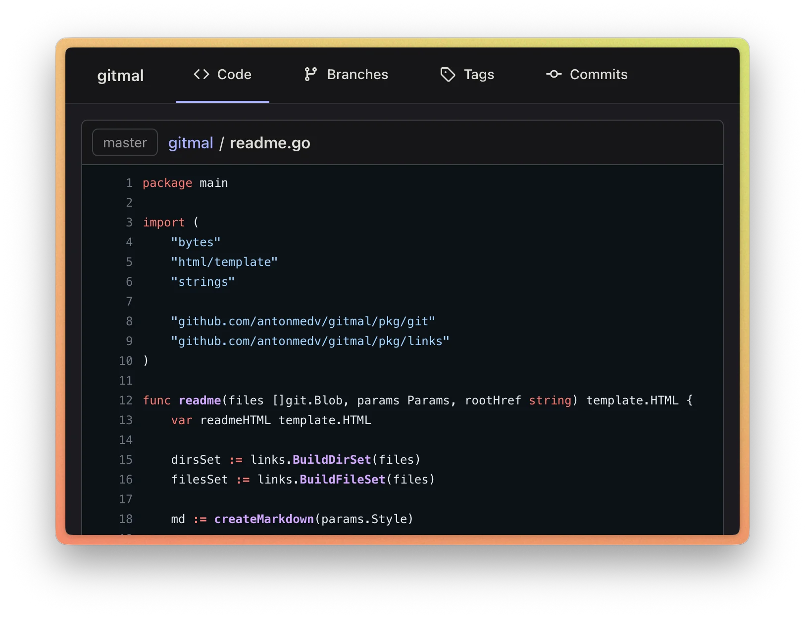
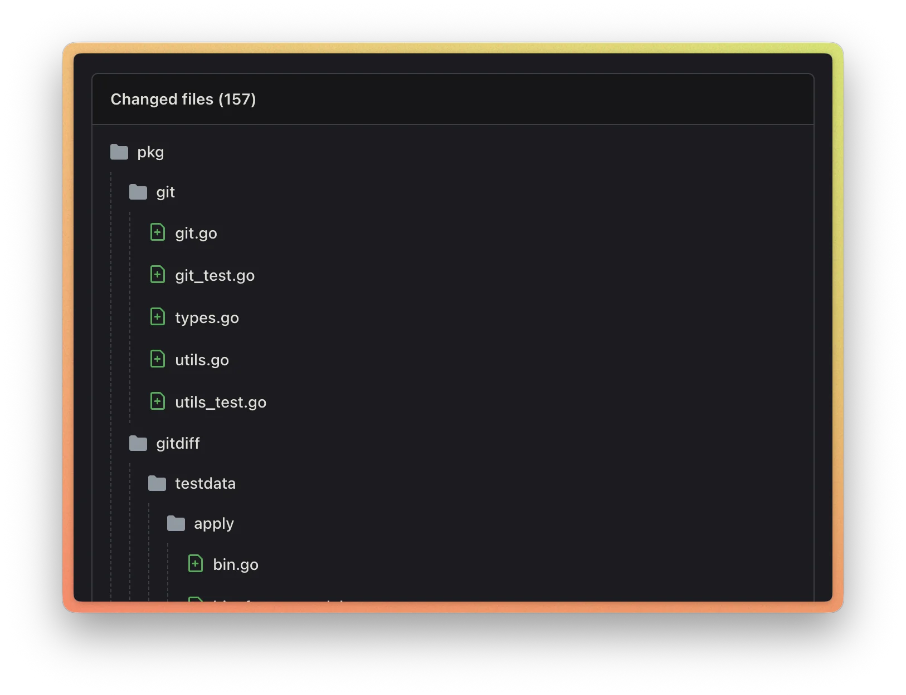
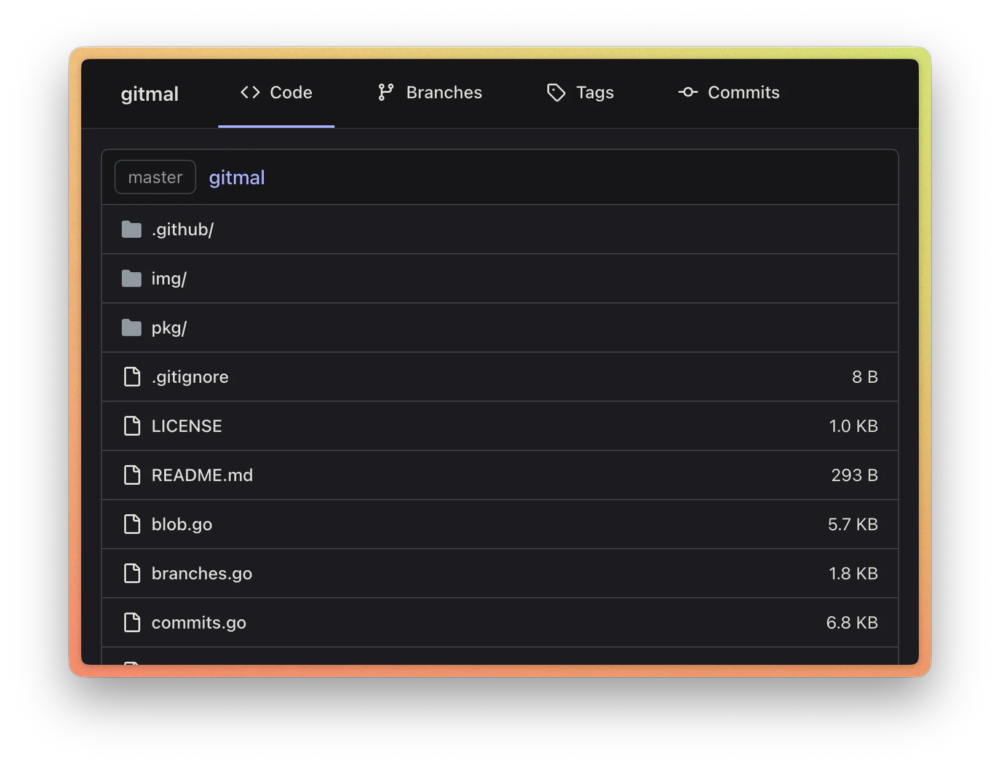

<p align="center"></p>

# Gitmal

Gitmal is a static page generator for Git repositories. Gitmal generates static HTML pages with files, commits,
code highlighting, and markdown rendering.

## Screenshots

<p align="center"></p>
<p align="center"></p>
<p align="center"></p>

## Themes

Gitmal supports different code highlighting themes. You can customize the theme with `--theme` flag.

```sh
gitmal --theme github-dark
```

## License

[MIT](LICENSE)
